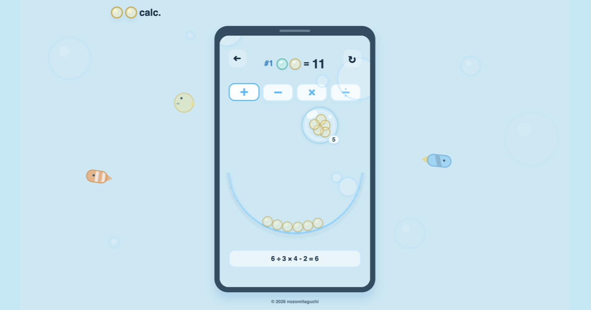

# まるまる電卓

**すうじをさわろう。**  
"まる"をさわって、動かして。足し算から割り算まで、数を見た目で感じる子ども向け計算あそびです。

[まるまる電卓をひらく](https://maru-maru-calc.github.io/maru-maru-calc/)



## まるまる電卓について

まるまる電卓は、答えだけを急がずに、数の変化をさわって発見するための計算あそびです。

- まるをさわって、動かして、数を見た目で感じられます。
- 足し算、引き算、掛け算、割り算の4つのさわりかたで遊べます。
- まちがえた時も、まるの動きから何が起きたかを見つけられます。
- 親子であそぶなら、3歳ごろからを想定しています。
- Webで遊べるほか、将来的にアプリ版としての展開も見据えています。

## 公開ページ

https://maru-maru-calc.github.io/maru-maru-calc/

## 開発

このプロジェクトは Expo Router / React Native Web で作っています。

```bash
npm install
npm run web
```

主なコマンド:

```bash
npm run typecheck
npm run test
npm run e2e
npm run export:web
```

## GitHub Pages

`main` ブランチへpushすると、GitHub ActionsでWeb版をエクスポートしてGitHub Pagesへデプロイします。

SNSやSlackで共有された時の表示用に、タイトル、description、OGP/Twitter Card、favicon、apple-touch-iconを設定しています。

## ライセンス

現時点ではライセンス未定です。無断での再配布や商用利用はしないでください。
